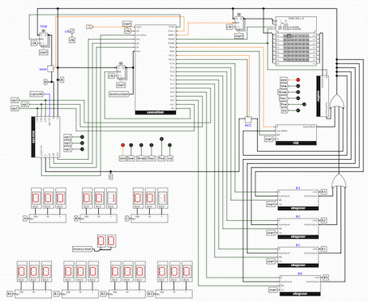
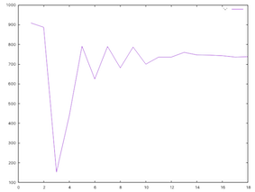
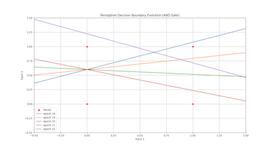

#  Hi, I'm Abdullah Al Maamari!  

**Mechanical Engineer | Self-Taught Programmer | AI & Systems Enthusiast**  

---

## **Background**  

- **Mechanical Engineer** transitioning into **Computer Science** with 15+ years of industry experience.  
- Passionate about **low-level computing, AI, software development, and logic-based problem solving**.  
- Merging **engineering, computational thinking, and programming** to solve complex challenges.  

---

## **Tech Stack & Interests**  

### **Programming & Software Development**  
- **Languages**: Python | C | SQL (SQLite)  
- **Frameworks**: Django  
- **Tools**: zch | clang | gcc | Git | Homebrew | SQLite | VSCode | Logisim Evolution  

---

## **Featured Learning Projects**  

### [8-bit Machine Simulator](https://github.com/aalmaamari/8bit-machine-simulator)  
- A **low-level computer simulation** designed to deepen **computational logic and programming knowledge**.  

---
### Guess Number Game - [C Version](https://github.com/aalmaamari/guess-the-number-C) & [Python Version](https://github.com/aalmaamari/guess-the-number-python)

 - An **interactive number-guessing game** showcasing **gradual learning and software optimization**. 
 
---

### [Neural Network Tutorials](https://github.com/aalmaamari/neural-network-tutorials)

- A **series of hands-on tutorials** exploring the **fundamentals of neural networks**, including **perceptrons, backpropagation, and deep learning basics**. Designed to **demystify AI concepts** through practical coding exercises.  

---

## **Currently Studying**  

**Books I’m Exploring:**  
- **C Programming**: [A Modern Approach](https://www.amazon.com/C-Programming-Modern-Approach-2nd/dp/0393979504)  
- **Algorithms & Data Structures**: [Mastering Algorithms with C](https://www.amazon.com/Mastering-Algorithms-Techniques-Sorting-Encryption/dp/1565924533)  
- **Linux Development**: [The Linux Programming Interface](https://www.amazon.com/Linux-Programming-Interface-System-Handbook/dp/1593272200)  
- **AI & Deep Learning**: [Deep Learning from Scratch](https://www.amazon.com/Deep-Learning-Scratch-Building-Principles/dp/1492041416)  

---

## **Let's Connect!**  

I love discussing **computing, AI, and system engineering**. Feel free to connect with me:  
  
**GitHub**: [aalmaamari](https://github.com/aalmaamari)  
**LinkedIn**: [Abdullah Al Maamari](https://www.linkedin.com/in/aalmaamari/)  
**Website**: [aalmaamari.github.io](https://aalmaamari.github.io/)

*"Always learning. Always experimenting."*   